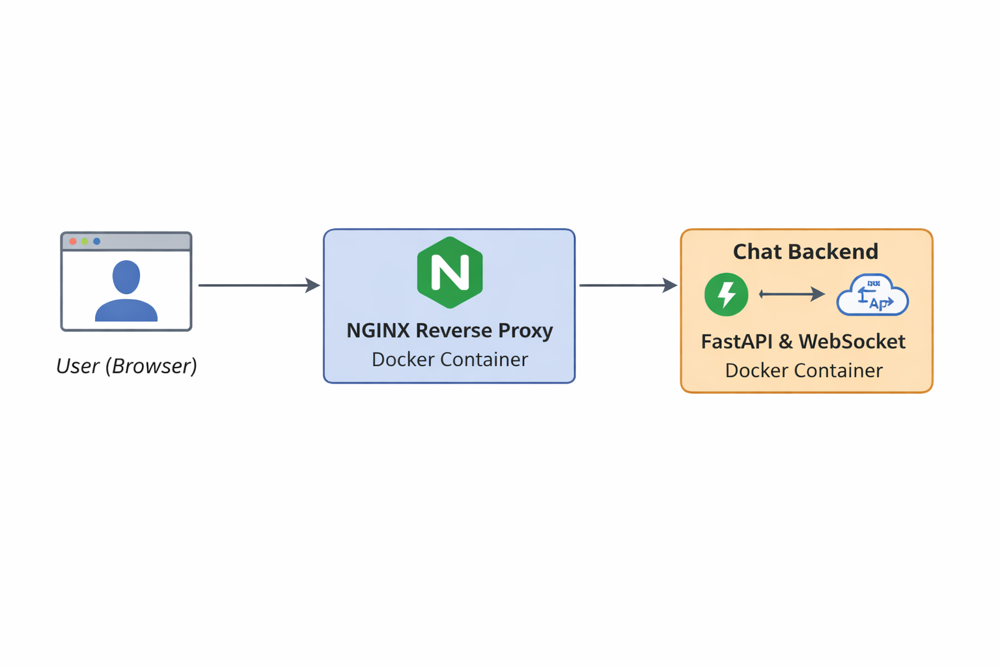
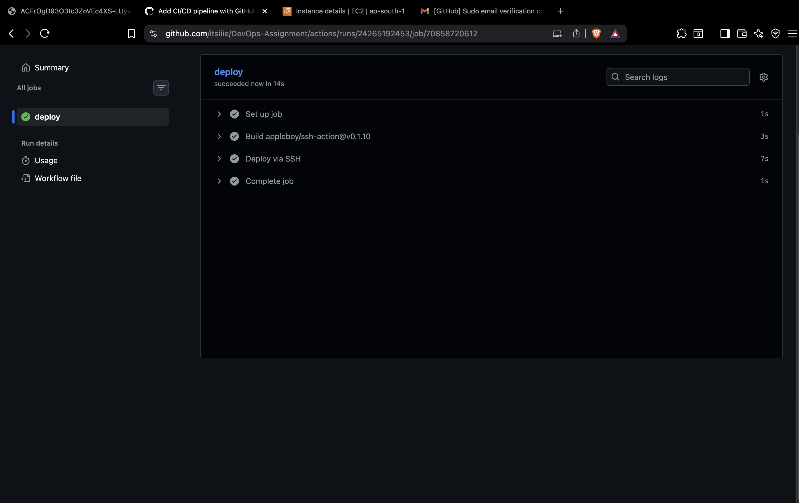
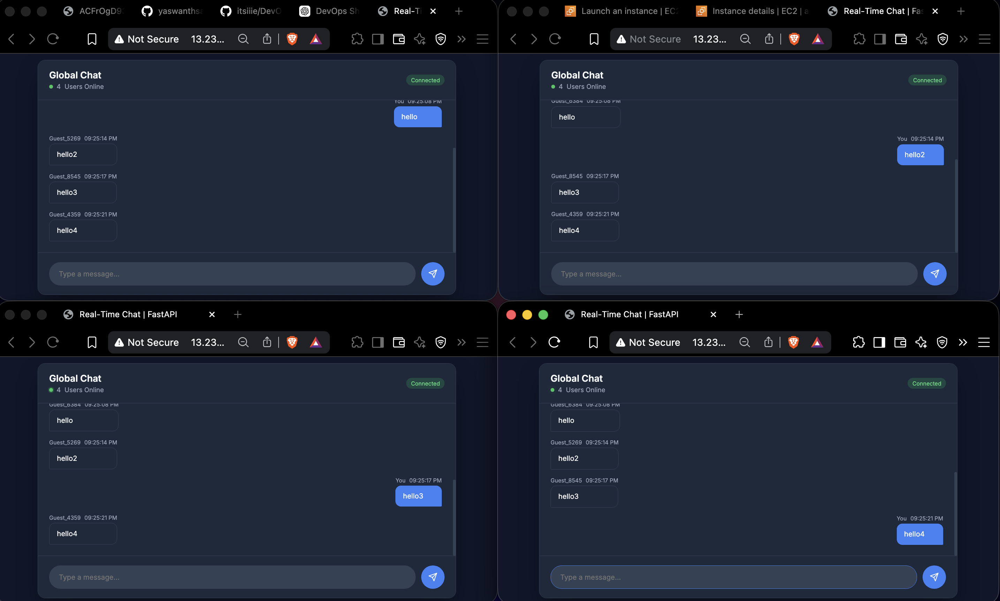

# DevOps Assignment – Real-Time WebSocket Application Deployment

##  Overview
This project demonstrates the deployment of a real-time WebSocket-based chat application using **Docker, NGINX reverse proxy, and CI/CD automation** in a production-style environment.

The goal of this assignment was to debug a **deliberately misconfigured system**, fix deployment issues, and make the application accessible via a public IP.

---

##  Architecture



---

##  Docker Setup

- Multi-container setup using **Docker Compose**
- Backend service built using FastAPI
- NGINX container for reverse proxy and frontend serving
- Containers communicate using Docker internal networking
- Restart policies added for resilience

---

##  NGINX Reverse Proxy

NGINX is configured to:
- Serve frontend static files
- Route WebSocket requests (`/ws`) to backend container
- Handle WebSocket upgrade headers properly
- Maintain persistent connections using timeout settings

---

## WebSocket Handling

To ensure real-time communication:
- Configured `Upgrade` and `Connection` headers
- Used `proxy_http_version 1.1`
- Increased timeout values for long-lived connections

This ensures multiple users can chat in real-time across different browser tabs.

---

##  Cloud Deployment

- Deployed on **AWS EC2 (Ubuntu)**
- Docker and Docker Compose installed on server
- Application accessible via public IP: 13.234.67.230

  **http://13.234.67.230**

---

##  CI/CD Pipeline (GitHub Actions)


A CI/CD pipeline is implemented using GitHub Actions:


Working Chat-App (Multiple Tabs):

### Workflow:
1. Triggered on every push to `main`
2. Connects to EC2 via SSH
3. Pulls latest code
4. Rebuilds Docker containers
5. Restarts services automatically

This ensures **automated and consistent deployments**.

---

##  Issues Identified & Fixes

### Issue 1: NGINX using localhost
- **Problem:** NGINX was trying to connect to `localhost`, which refers to itself inside the container  
- **Fix:** Updated to use Docker service name  
proxy_pass http://chat-backend:8000;


---

### Issue 2: WebSocket not working
- **Problem:** Missing WebSocket upgrade headers  
- **Fix:** Added required headers:
proxy_set_header Upgrade $http_upgrade;
proxy_set_header Connection "Upgrade";


---

### Issue 3: Default NGINX page showing
- **Problem:** Frontend files were not mounted  
- **Fix:** Mounted frontend directory:
./frontend:/usr/share/nginx/html


---

### Issue 4: Backend not accessible
- **Problem:** Backend bound to `127.0.0.1`  
- **Fix:** Changed to: --host 0.0.0.0


---

### Issue 5: WebSocket connection timeout
- **Problem:** Connection dropped due to default timeout  
- **Fix:** Increased timeout:proxy_read_timeout 86400;


---

##  How to Run Locally

```bash
git clone <your-repo-link>
cd DevOps-Assignment

docker-compose up -d --build
```
Open:
```bash
http://localhost
```